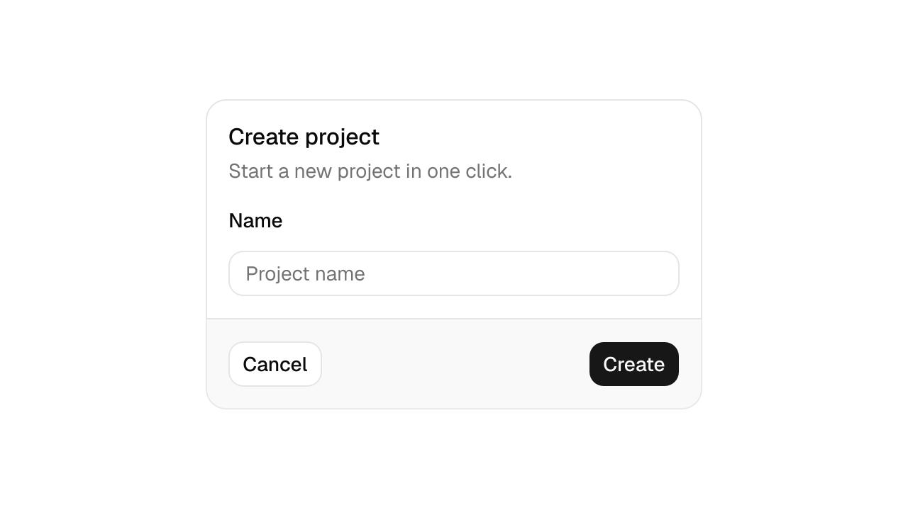

<h1 align="center">shadcn-cpp</h1>
<p align="center">shadcn/ui components for native C++ applications.</p>
<p align="center">
  <a href="LICENSE"></a>
  
  
  
</p>
<p align="center">
  
  
  
</p>
<p align="center"><a href="https://whitehades.github.io/shadcn-cpp/">Documentation</a> · <a href="https://whitehades.github.io/shadcn-cpp/components">Components</a> · <a href="https://whitehades.github.io/shadcn-cpp/api">C++ API</a></p>

The design and motion of shadcn, built with native C++ and Qt Widgets. Small APIs, shared themes and ordinary Qt ownership. Builds use C++26 where supported, with C++23 as the baseline.

<p align="center">
  <picture>
    <source media="(prefers-color-scheme: dark)" srcset="assets/previews/card-dark.png" />
    
  </picture>
</p>

Version **0.1.0** is in development. Linux builds and tests pass with Qt 6.11.2. Windows and macOS verification is pending.

## Build

Install a C++23 compiler, CMake 3.25 or later, Ninja and Qt 6.8 or later with Widgets.

```sh
cmake -S . -B build -G Ninja -DCMAKE_BUILD_TYPE=Release
cmake --build build
./build/shadcn_gallery
```

## Use

```cpp
#include <shadcn/shadcn.hpp>

shadcn::install(app);

auto& button = shadcn::make_child<shadcn::Button>(window, "Continue");
button.setVariant(shadcn::Variant::Outline);
layout.addWidget(&button);
```

Link `shadcn::widgets`. Qt parents own their child widgets. The [installation guide](https://whitehades.github.io/shadcn-cpp/getting-started) includes a complete application and CMake example. `shadcn::core` is also available without Qt.

MIT. Adapted from [shadcn/ui](https://github.com/shadcn-ui/ui), with its [licence retained](LICENSES/shadcn-MIT.txt). This is an independent port.
